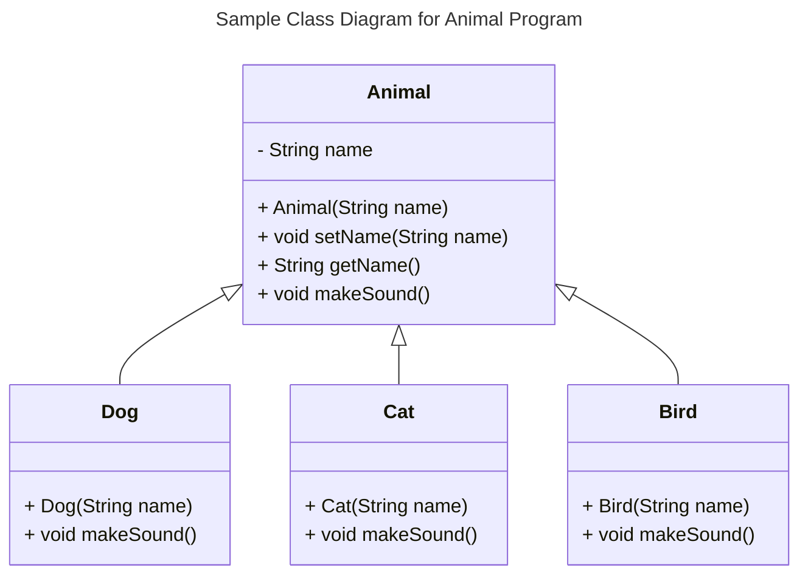

# Specification Document

Please fill out this document to reflect your team's project. This is a living document and will need to be updated regularly. You may also remove any section to its own document (e.g. a separate standards and conventions document), however you must keep the header and provide a link to that other document under the header.

Also, be sure to check out the Wiki for information on how to maintain your team's requirements.

## TeamName

<!--The name of your team.-->

### Project Abstract

<!--A one paragraph summary of what the software will do.-->

The Campus Rating System is a mobile application designed to enhance the student experience by providing a platform for discovering, rating, and sharing various locations on campus. This innovative tool aims to help students find ideal spots for studying, relaxing, or engaging in specific activities. 

### Customer

<!--A brief description of the customer for this software, both in general (the population who might eventually use such a system) and specifically for this document (the customer(s) who informed this document). Every project will have a customer from the CS506 instructional staff. Requirements should not be derived simply from discussion among team members. Ideally your customer should not only talk to you about requirements but also be excited later in the semester to use the system.-->
The primary target audience for this software consists of UW-Madison students seeking convenient and suitable spaces on campus for various activities, including studying, napping, socializing, or engaging in other leisure pursuits. These students range from freshmen to graduate students across all disciplines, each with unique needs and preferences for campus spaces.
Secondary users may include UW-Madison faculty and staff who are looking for quiet areas to work, hold informal meetings, or take short breaks between classes or appointments.
Specific customers informing this document include:

1.A representative from the CS506 instructional staff, who will provide guidance and evaluate the project's alignment with course objectives.
2.A diverse group of UW-Madison students, including:

- An undergraduate student living off-campus who needs quiet study spots between classes
- A graduate student seeking comfortable areas for group project meetings
- An international student looking for welcoming spaces to socialize and meet new people
- A student athlete searching for convenient nap locations between practice sessions and classes
3.A faculty member interested in finding alternative workspaces outside their office

### Specification

<!--A detailed specification of the system. UML, or other diagrams, such as finite automata, or other appropriate specification formalisms, are encouraged over natural language.-->

<!--Include sections, for example, illustrating the database architecture (with, for example, an ERD).-->

<!--Included below are some sample diagrams, including some example tech stack diagrams.-->

#### Technology Stack

Mapping will be handled via OpenStreetMaps using Leaflet.

A <-->|"REST API"| B

#### Database

#### Class Diagram

#### Flowchart

#### Behavior

#### Sequence Diagram

### Standards & Conventions

<!--This is a link to a seperate coding conventions document / style guide-->
[Style Guide & Conventions](STYLE.md)
